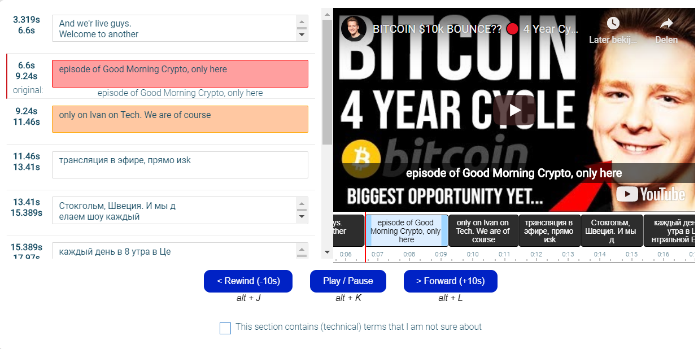

# Subtitle Editor

## Usage

The Subtitle Editor Vue component can be included in javascript and used within
your template:

```
<script src="https://files.effect.ai/tmp/SubtitleEditor.umd.min.9.js"></script>
<link href="https://files.effect.ai/tmp/SubtitleEditor.css" rel="stylesheet">

<div id='task'>
  <subtitle-editor
    srt-url="https://files.effect.ai/translate/media/ama.srt"
    video-url="https://files.effect.ai/translate/media/ama.mp4"
    ids="[1, 2, 3]">
  </subtitle-editor>
</div>

<script>
new Vue({
  el: '#task',
  data () {
    return {
    }
  },
  components: {
    'subtitle-editor': SubtitleEditor
  }
});
</script>
```

## Building

Given the size of the component it's best to compile it to a separate javascript
file and include that in your template. See [template.html](template.html) for
an example.

The javascript component can be built with:

```
yarn install
npx vue-cli-service build --formats umd-min --target lib --name SubtitleEditor src/SubtitleEditor.vue
```

## Editable Preview

coming soon

## Screen

