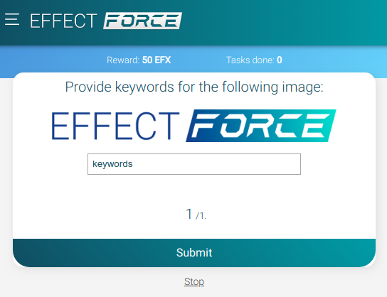

<p align="center"></p>

<p align="center"></p>

<h1 align="center">Effect Force Templates</h1>

Repository for task templates to use on the Effect Force micro tasking platform.

## Templates Content

1. [PolygonAnnotation](./templates/PolygonAnnotation/README.md)
1. [ImageViewer](./templates/ImageViewer/)

## Default Templates

Effect Force provides Default Templates that make it easy for Requesters to get started creating tasks for Workers. It is important that the design of the tasks are clear and easy to use, as it enables Workers to efficiently complete the work and provide better quality. The default templates are a great starting point and serve as an example for Requesters that want to design tasks that Workers will love. Each default template is easy-to-use and can be customized to your needs with small modifications to its code. All Default Templates are mobile-ready from the start and have been optimized to be friendly and efficient for workers. Effect Force will provide default templates for surveys, images, video, audio transcription, map annotations, pixel annotations, bounding box annotations, sentiment analysis and more!

## Compatible with Amazon Mturk Layouts

It’s no secret we want every Requester from Amazon’s mturk platform to join and use the Effect Force platform instead! To accomplish this we need to give those Requesters as many reasons as possible to make the switch. That’s why the Effect Generic Templates are 100% compatible with Amazon MTurk Layouts. This gives Requesters the possibility to seamlessly copy and paste their tasks from Amazon MTurk directly to Effect Force without having to change anything!

## Parameter Substitution

The Generic Templates also allow Requesters to use placeholders in their templates. These placeholders are replaced with values from a list of tasks where each row contains all the values for the parameters of a task. The column names of the list with tasks must match the parameter names used in the template. Requesters can use this parameter substitution capability to create a large number of tasks that all share a common layout and design (template).

For example: you want to create a tasks that asks Workers to provide keywords for images. You create the template for that task for a single image once and you use a placeholder `${image_url}` for the source of the image:

```html
<p>Provide keywords for the following image:</p>


<input type="text" name="keywords" />
```

This template can be used with a list of placeholders for each task:

```
"image_url"
"https://force.effect.ai/image1.png"
"https://force.effect.ai/image2.png"
"https://force.effect.ai/image3.png"
```

This will result in three tasks that each contain a different picture, but share a common template. A single task will look like this on the Effect Force platform:

<p align="center"></p>


## Preview Tool

Visit the [preview tool](https://api.beta.effect.ai/template/preview) to modify your template to your likings.

## Contributing

Please read [CONTRIBUTING.md](CONTRIBUTING.md) for details on our code of conduct, and the process for submitting pull requests to us.

## Authors

* **Sjoerd Dijkstra** - *Initial work / Templates* - [GitHub](https://github.com/sjoerd-dijkstra)
* **Jesse Eisses** - *Initial work / Templates* - [GitHub](https://github.com/jeisses)
* **Laurens Verspeek** - *Initial work / Templates* - [GitHub](https://github.com/laurensV)

## License

This project is licensed under the MIT License - see the [LICENSE](LICENSE) file for details.
