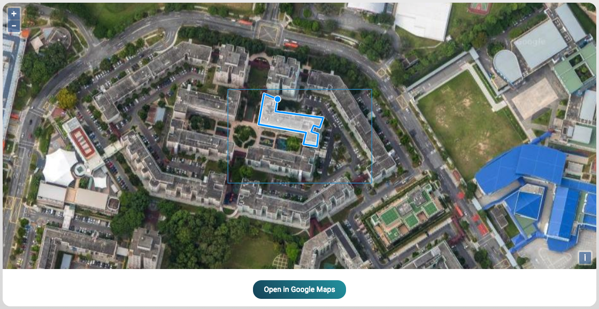

# Polygon Annotator

## Preview

Click 
[here](https://api.beta.effect.ai/template/preview?templateUrl=https://gist.githubusercontent.com/laurensV/5016683a9882e7ccf17d5dd7a6dbff26/raw/7915f1e2f38fc37152fe4eb0a65fb9b92cf2754c/gistfile1.txt)
to edit polygon annotation in the effect force template preview tool.

## Example

To load an example task, paste these coordinaties in the placeholder field, and click `preview`.
```json
{"cords":"{\"lat\": \"52,405760\", \"lon\": \"4,892250\"}"}
```

## How to use
...

## Screen
