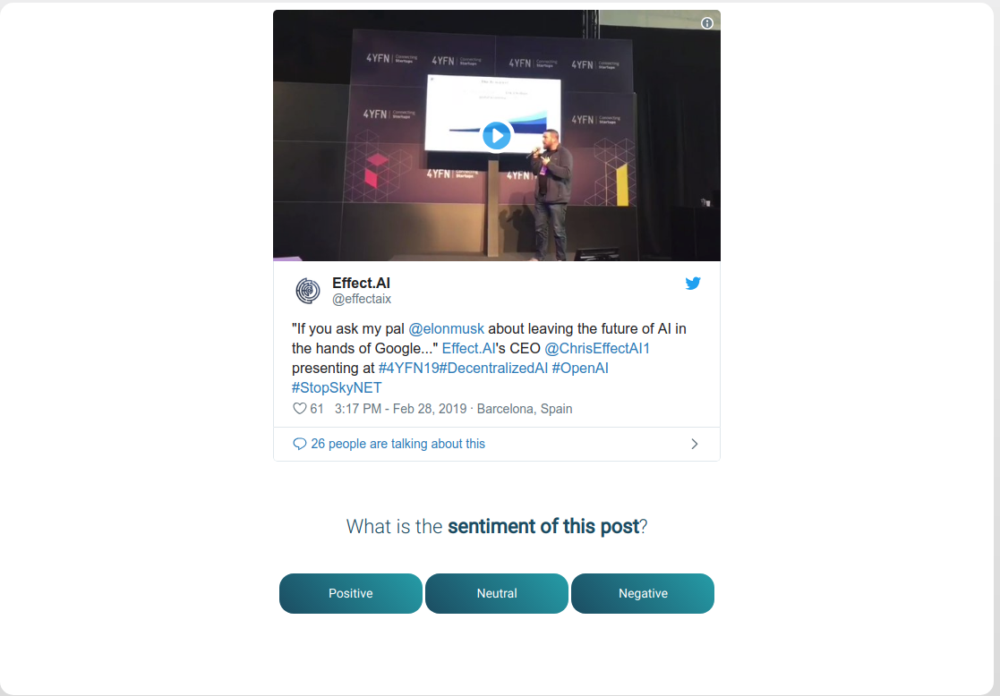

# Tweet Sentiment Analysis

## Preview

Click 
[here](https://api.beta.effect.ai/template/preview?templateUrl=https://raw.githubusercontent.com/effectai/effect-force-templates/master/templates/TweetSentiment/template.html&options[default_styling]=true&placeholders[tweetlink]=https://twitter.com/effectaix/status/1101109072445796352)

to edit tweet sentiment analysis template in the effect force template preview tool.

## How to use
Use this template to load tweets (or pages) and determine the sentiment of the tweet.

## Screen

